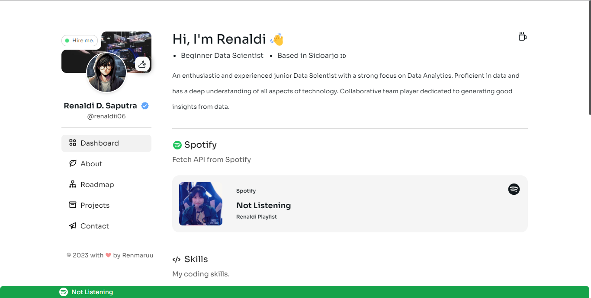
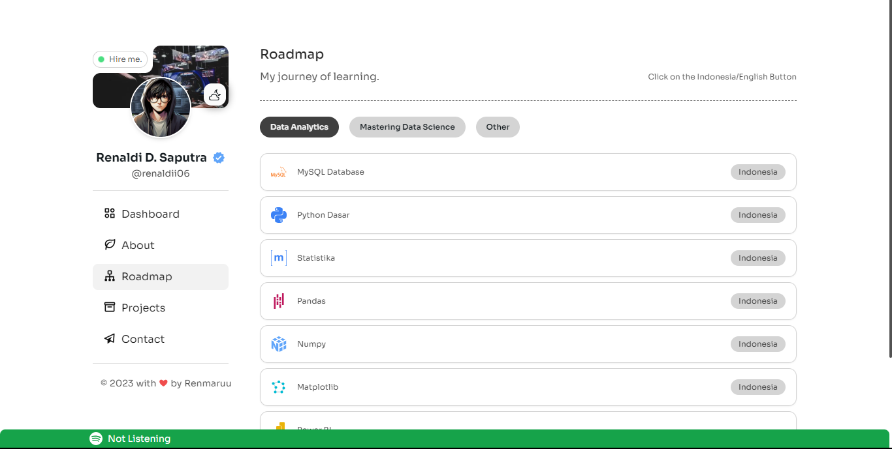

# Renaldi Portfolio Site

## Preview





## Stack

- [NextJS 14](https://nextjs.org) - Next.js is a React framework for building full-stack web applications
- [TailwindCSS](https://tailwindcss.com) - A utility-first CSS framework packed with classes that can be composed to build any design, directly in your markup.
- [Framer Motion](https://framer.com/) - API to provide motion animation for the application we are creating

## Running Locally

This application requires Node.js v18.17+.

```bash
git clone https://github.com/renal-d/personal-portfolio
cd personal-portfolio
npm install
npm run dev
```

Create a .env file similar to .env.example.

## Cloning / Forking

Please review my personal content and Give Star 💕.